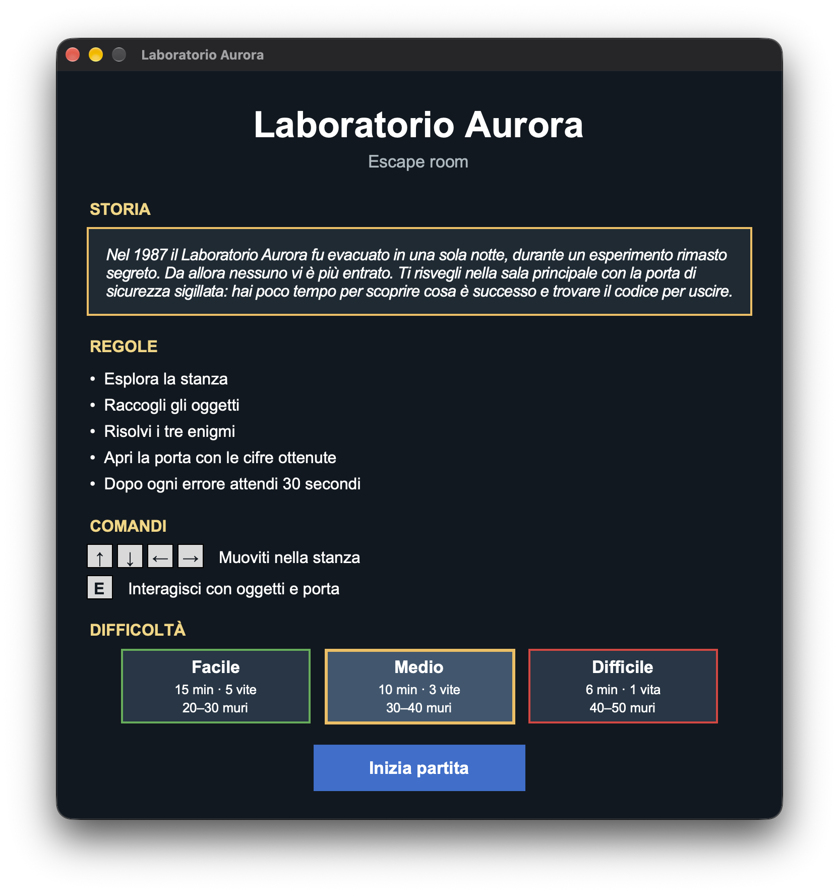
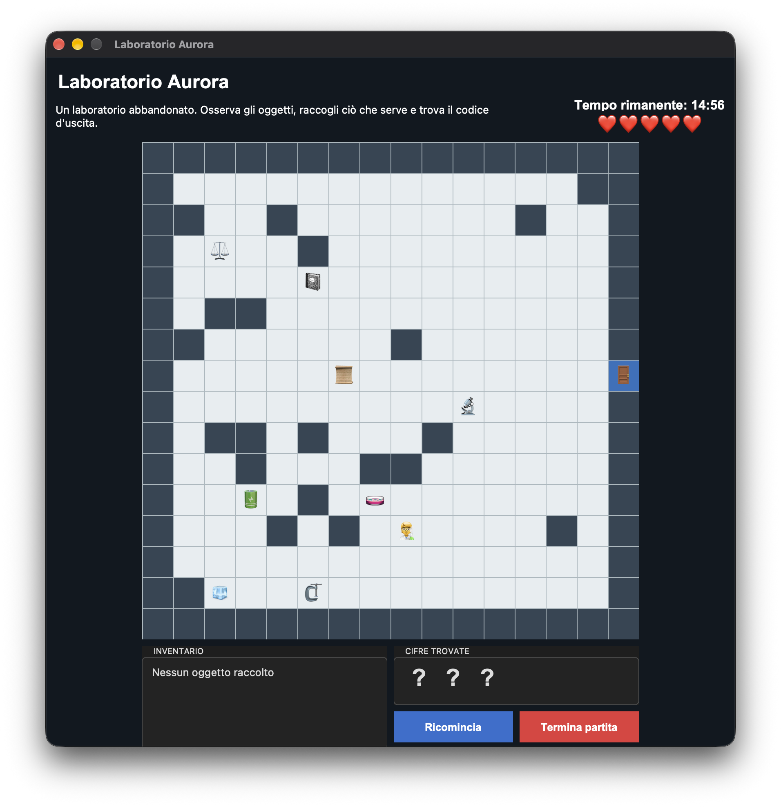

# Escape room: Laboratorio Aurora

Escape room in Python con interfaccia grafica Tkinter, sviluppata
interamente tramite prompt a ChatGPT (GPT-5.6 Sol) per il corso di
**Intelligenza Artificiale Generativa** (Università Politecnica delle
Marche, A.A. 2025-2026).

Il giocatore esplora una stanza a griglia, raccoglie oggetti e risolve tre
enigmi per ricostruire il codice che apre la porta, entro un tempo limite e
con un numero limitato di vite. Sono previsti tre livelli di difficoltà.

<table>
<tr>
<td width="50%"></td>
<td width="50%"></td>
</tr>
<tr>
<td align="center"><em>Schermata iniziale</em></td>
<td align="center"><em>Partita in corso</em></td>
</tr>
</table>

## Organizzazione del repository

```
escape-room-laboratorio-aurora/
├── README.md
├── requirements.txt          # dipendenze per aprire il notebook
├── gen_ai.ipynb              # i 20 prompt, con file e schermate di ogni versione
├── codice/
│   ├── enigmi.json           # enigmi, oggetti e indizi generati dal modello
│   ├── prompt03.py           # prima versione del gioco
│   ├── prompt04.py … prompt16.py
│   ├── prompt16_prima_versione.py
│   ├── prompt17_18.py
│   ├── prompt19.py
│   └── prompt20.py           # versione finale
└── img/
    ├── prompt01_1.png        # schermate, numerate come i prompt
    └── …
```
### Elenco dei prompt

| Prompt | Richiesta | File |
|---|---|---|
| 1–2 | Generazione e correzione degli enigmi | `codice/enigmi.json` |
| 3 | Prima versione del gioco | `codice/prompt03.py` |
| 4 | Ordine delle cifre | `codice/prompt04.py` |
| 5 | Notifiche sulla mappa | `codice/prompt05.py` |
| 6 | Riquadro dell'inventario | `codice/prompt06.py` |
| 7 | Stanza generata casualmente | `codice/prompt07.py` |
| 8 | Tempo limite | `codice/prompt08.py` |
| 9 | Vite | `codice/prompt09.py` |
| 10 | Finestra di fine partita | `codice/prompt10.py` |
| 11 | Attesa dopo un errore | `codice/prompt11.py` |
| 12 | Aggiornamento dei secondi di attesa | `codice/prompt12.py` |
| 13 | Pannello sotto la mappa | `codice/prompt13.py` |
| 14 | Pulsante "Termina partita" | `codice/prompt14.py` |
| 15 | Pulsante "Ricomincia" | `codice/prompt15.py` |
| 16 | Emoji | `codice/prompt16.py` |
| 17–18 | Notifiche a fumetto e schermata iniziale con livelli | `codice/prompt17_18.py` |
| 19 | Grafica della schermata iniziale | `codice/prompt19.py` |
| 20 | Ritorno alla schermata iniziale | `codice/prompt20.py` |


## Requisiti

- **Python 3.10 o successivo.**
- **Tkinter**, la libreria grafica usata dal gioco. Non si installa con
  `pip`:
  - **Windows:** è inclusa nell'installer di python.org;
  - **macOS:** è inclusa nell'installer di python.org; con Homebrew serve
    `brew install python-tk`;
  - **Linux (Debian/Ubuntu):** `sudo apt install python3-tk`.

  Per verificare che sia presente:

  ```bash
  python3 -m tkinter
  ```

  Se si apre una piccola finestra, Tkinter funziona.

Il gioco non usa altre librerie esterne. `requirements.txt` serve solo per
aprire il notebook.

## Avvio

### Solo il gioco

Dalla cartella del repository:

```bash
python3 codice/prompt20.py
```

Per provare una versione precedente basta cambiare il numero del file, ad
esempio `python3 codice/prompt09.py`.

### Notebook

1. Crea e attiva un ambiente virtuale:

   ```bash
   python3 -m venv .venv
   source .venv/bin/activate        # Windows: .venv\Scripts\activate
   ```

2. Installa le dipendenze:

   ```bash
   pip install -r requirements.txt
   ```

3. Apri il notebook:

   ```bash
   jupyter notebook gen_ai.ipynb
   ```

4. Esegui la prima cella di codice, che definisce la funzione `avvia`. Poi
   esegui la cella sotto il prompt che ti interessa, ad esempio
   `avvia("codice/prompt20.py")`. Il gioco si apre in una finestra
   separata.

## Comandi di gioco

| Tasto | Azione |
|---|---|
| Frecce | Muovono il giocatore |
| E | Interagisce con l'oggetto o la porta adiacente |

## Autori

Valeria Cannone, Alessandro Pettinaro, Giada Remedia
